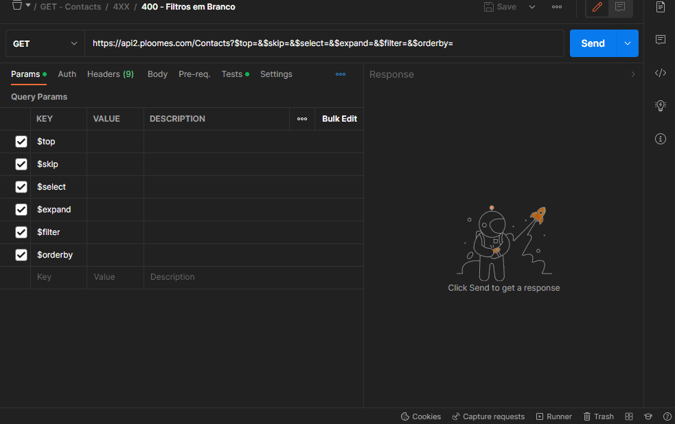
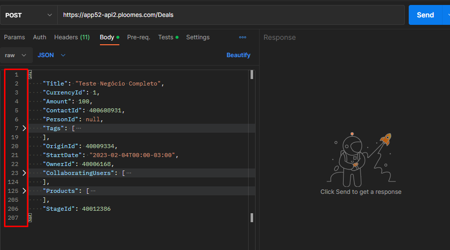

# Testes de API  
# Automatização com Postman e Newman  
  
## Instruções de Execução  
  
## Postman  
Importe as Collectios: **Contacts.postman_collection.json** e **Deals.postman_collection.json** diretamente para o Postman junto com o arquivo de environments globais, **workspace.postman_globals.json**. É possivel analisar cada teste pela guia "Tests" das requests ou abrir o "Runner" e rodar por pastas por comportamento de Drag and Drop.  
##  Newman com HTML Extra
Execute o Newman diretamente pelo terminal com os comandos abaixo, ou HTML Extra para relatórios .html como os arquivos: **Ploomes - Contacts - 04-02-2023.html** e **Ploomes - Deals - 04-02-2023.html**). Abra no terminal a pasta do Newman, instale as dependências com **npm install** e execute os comandos:  
  
> **Newman**  
newman run newman/Contacts.postman_collection.json --globals newman/workspace.postman_globals.json  
newman run newman/Deals.postman_collection.json --globals newman/workspace.postman_globals.json  
  
> **HTML Extra**  
newman run newman/Contacts.postman_collection.json --globals newman/workspace.postman_globals.json -r htmlextra  
newman run newman/Deals.postman_collection.json --globals newman/workspace.postman_globals.json -r htmlextra  
  
## Limitações e BUGs  
  
1. Precisam existir tratativas dos campos diretamente na API, trazendo erros quando envio campos com **tipagem inválida** e **parâmetros em branco**;
2. A API precisa ter redundância nas regras do frontend para evitar que alguém com conhecimento técnico não envie dados indesejáveis via API. Segue os exemplos dos campos de **CPF**, **CNPJ**, **E-mail**, **Telefone (em geral)**, etc. Todos os campos que tem formatos conhecidos, é fundamental ter algumas tratativas de REGEx e impedir o cadastro;
3. Os endpoints de cadastros e atualizações estão aceitando requests com parâmentro em branco: '**{}**', com uma simples tratativa é possivel evitar chamadas para o servidor e dados poluídos e desnecessários no banco de dados;
4. É necessário revisitar os padrões de retorno e padronizá-los. Segue abaixo dois exemplos:
    1. Os retornos de 401 (Não autorizado) do endpoint **POST /Contacts** não retorna response no body, já o endpoint **POST /Deals** retorna;
    2. Os retornos de 404 (Quando passo um ID que não existe) do endpoint **DELETE /Contacts** retornou 500, o endpoint **DELETE /Deals** retornou corretamente 404;

## Sugestões e Melhorias

1. Seria interessante mudar o Status dos métodos **POST** e **PATCH** para 201, e o **DELETE** para 204;
2. Para erros de 400, é aconselhável voltar um array de erros, pois como se trata de erros de campos, é preferível ver em uma única response tudo que está inválido. EX:  
  
3. Acho válido revisitar a arquitetura dos serviços como um todo. Ao preencher os formulários no frontend e analisar a requisição que é feita, percebo que o serviço recebe muitos campos a mais dos preenchidos. Segue o exemplo do cadastro de novos negócios, a request após preencher todos os campos tem mais de 200 linhas de **JSON**, verifiquem o que é crucial de fato para a request e o que não for, criem novos serviços específicos;  
  
4. Verificar quais campos são obrigatórios para uma requisição e implementar tanto no frontend quanto no backend para evitar chamadas em branco e sem dados importantes;
5. Incluir na documentação informações de **min** e **máx** de caracteres, tipagem, exemplo de dados e qual o retorno esperado do serviço;
6. As requisições não precisam conter campos com valores **null**, o exemplo é tanto para o frontend mandando a requisição para o backend, quanto o backend mandando informações para popular o frontend. Se o campo não tem valor, não é necessario enviá-lo e recebe-lo.
